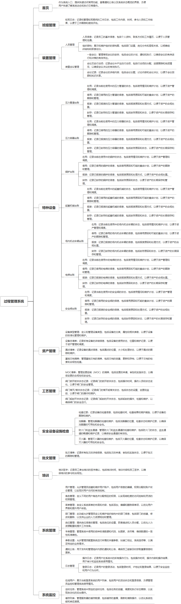

 

    
 

公司拥有上百套具有自主知识产权的软件系统，详情请查看码云首页或公司官网

 
<h1>过程管理系统</h1>

<a href="https://www.haishi.net.cn/">公司官网</a> ｜ <a href="https://www.haishi.net.cn/">在线体验</a>

 

## 系统介绍

生产过程管理系统是一款全面的企业生产管理工具，它融合了系统监控、工艺管理、班组管理、可靠性管理、安全设备设施检查、资产管理、特种设备台账维护、文档管理等多个功能模块。系统支持从生产计划、装置管理到目标达成的全流程监控，确保生产过程的高效、安全与合规。同时，系统还涵盖了人员管理、装置会议管理、日志管理以及各类设备台账的维护，为企业的生产活动提供强有力的数据支持和资源管理，助力企业实现生产目标，提升整体生产效能。
生产过程管理系统是一款全面的企业生产管理工具，它融合了系统监控、工艺管理、班组管理、可靠性管理、安全设备设施检查、资产管理、特种设备台账维护、文档管理等多个功能模块。系统支持从生产计划、装置管理到目标达成的全流程监控，确保生产过程的高效、安全与合规。同时，系统还涵盖了人员管理、装置会议管理、日志管理以及各类设备台账的维护，为企业的生产活动提供强有力的数据支持和资源管理，助力企业实现生产目标，提升整体生产效能。
本项目名称为过程管理系统，是一款用于企业内部流程管理的系统，涵盖了从人员管理、会议安排到特种设备管理、资产管理、工艺管理、安全管理、培训管理等多个方面。
本项目主要功能模块包括：
-  登录系统：提供用户登录功能。
-  首页：展示系统概览信息。
-  班组管理：进行班组信息管理，例如轮班日志。
-  人员管理：进行人员信息和组织架构管理。
-  会议管理：提供会议安排、记录、历史行动项追踪等功能。
-  特种设备：对压力管道、压力容器、锅炉、起重机械、场内机动车辆、电梯、安全阀等特种设备进行台账管理，包括在用、停用、报废、封存等状态。
-  资产管理：进行设备类型管理、设备总清单、漏点清单、基础文档清单、资产运营清单、固定资产清单等资产相关管理。
-  工艺管理：管理MOC清单、阀门状态记录等工艺信息。
-  安全设备设施检查：进行安全设备设施检查记录，例如洗眼器、防火门和逃生通道、灭火器等。
-  批文管理：进行批文清单管理。
-  培训：记录培训签字信息。
-  系统管理：进行用户管理、角色管理、部门管理、通知公告等系统配置。
                

## 系统功能介绍

### 系统包含终端说明

管理端（WEB）

| 序号 | 模块 | 模块说明 |
| --- | --- | --- |
| 1 | GC-PMS-ZBZZ-SERVER | 服务端 |
| 2 | GC-PMS-ZBZZ-MANAGE | 管理端 |

### 系统功能结构

### 系统功能说明

- 特种设备管理：系统对多种特种设备进行全生命周期管理，覆盖了从投入使用到报废的各个环节，对于保障企业安全生产至关重要。
- 资产管理：系统提供了全面的资产管理功能，涵盖了设备类型管理、设备清单、资产运营等多个方面，有助于企业实现资产的精细化管理。
- 安全设备设施检查：系统提供了安全设备设施检查记录功能，可以帮助企业及时发现安全隐患，保障生产安全。
- 会议管理：系统提供了会议安排、记录、行动项追踪等功能，可以帮助企业提高会议效率，提升团队协作能力。
- 人员管理：系统提供了人员信息和组织架构管理功能，可以帮助企业进行人员的有效管理。

## 系统主要界面

## 系统技术说明

### 代码模块说明

| 序号 | 目录 | 目录说明 |
| --- | --- | --- |
| 1 | GC-PMS-ZBZZ-SERVER/cpms-framework | -- |
| 2 | GC-PMS-ZBZZ-SERVER/cpms-quartz | -- |
| 3 | GC-PMS-ZBZZ-SERVER/cpms-common | -- |
| 4 | GC-PMS-ZBZZ-SERVER/cpms-system | -- |
| 5 | GC-PMS-ZBZZ-SERVER/cpms-generator | -- |
| 6 | GC-PMS-ZBZZ-SERVER/cpms-admin | -- |
| 7 | GC-PMS-ZBZZ-SERVER/documents | -- |
| 8 | GC-PMS-ZBZZ-SERVER/.idea | -- |

### 系统技术选型

#### 开发语言/框架

JAVA（JDK1.8）

#### 服务中间件

Nginx
Tomcat

#### 数据库

MySQL（5.7+）

#### 其他说明

无

## 系统演示/商用

请扫码添加客服微信获取演示地址和系统详细资料。

如果您想基于过程管理系统进行商业化交付或定制开发服务，我们提供有偿的技术服务支持，合作模式不限，欢迎沟通！

公司官网地址： <a href="https://www.haishi.net.cn/">https://www.haishi.net.cn</a>

联系客服获取专业回答。

## 使用须知

1、 本项目商用必须获得版权所有者的授权。

2、 未经允许本项目代码不允许二次出售。

